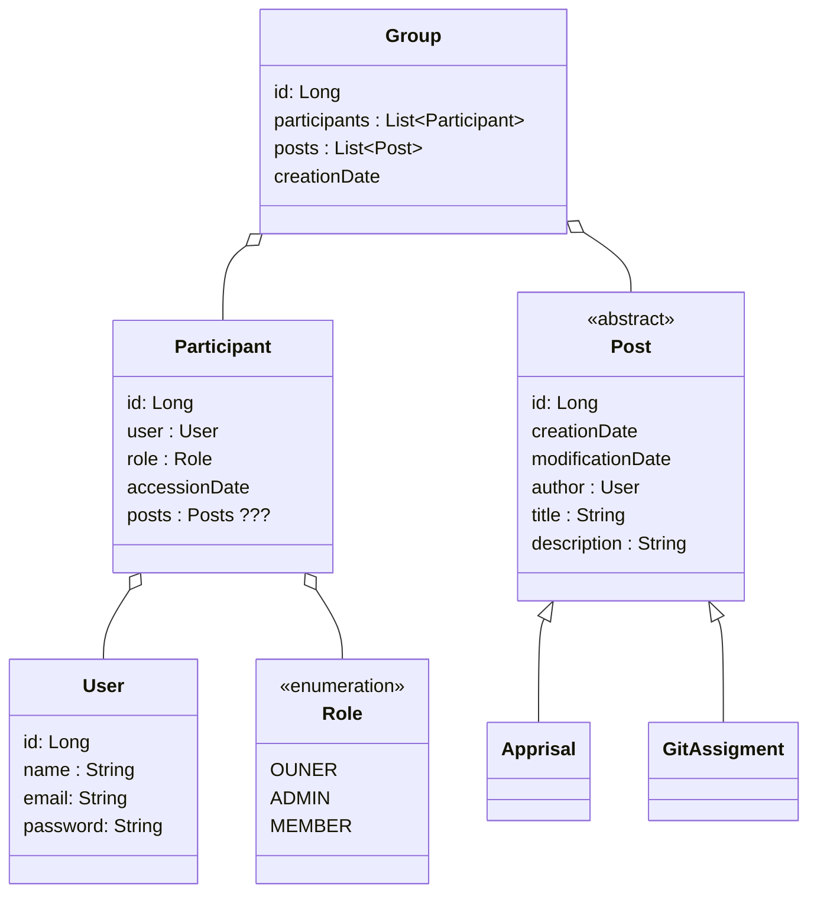

```mermaid
classDiagram
    Participant o-- User
    Participant o-- Role
    Group o-- Participant
    Group o-- Post
    Post <|-- Apprisal
    Post <|-- GitAssigment

    class User {
        id: Long
        name : String
        email: String
        password: String
    }
    class Participant {
        id: Long
        user : User
        role : Role
        accessionDate
        posts : Posts ???
    }
    class Role {
        <<enumeration>>
        OUNER
        ADMIN
        MEMBER
    }
    class Group {
        id: Long
        participants : List~Participant~
        posts : List~Post~
        creationDate
    }
    class Post {
        <<abstract>>
        id: Long
        creationDate
        modificationDate
        author : User
        title : String
        description : String
    }
    class Apprisal{

    }
    class GitAssigment {

    }
```
